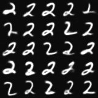

<div align="center">

# VQ-VAE + GPT on JAX (and Haiku :scroll:)

</div>

This is an implementation of VQ-VAE with a GPT-style sampler 
on the [JAX](https://github.com/google/jax) and 
[Haiku](https://github.com/deepmind/dm-haiku) ecosystem.

Instead of using a PixelCNN to sample from the latent space like the
[original paper](https://arxiv.org/pdf/1711.00937.pdf), this 
implementation uses a GPT-style, decoder-only transformer to generate samples.

## :star2: Results

<div align="center">





</div>

> Generated with 
> ```terminal
> python -m generate -p runs/gpt/exp50 -o generated/exp50 -t 0.4 -S 5

## :nut_and_bolt: Run it yourself!

### Step 0: (Optional, recommended) Create virtual environment


### Step 1: Install requirements

**You will need to install JAX separately.** This is because 
the installation procedure will be different depending on which 
platform / accelerator / CUDA version you are on.

Please follow [these instructions](https://github.com/google/jax#installation) 
to install JAX accordingly.

Then, install the project's dependencies

```terminal
pip install -r requirements.txt
```

### Step 2: Create & modify `train_vqvae_config.json`

Create a copy of the included sample JSON file.

```terminal
cp static/configs/train_vqvae_config.json train_vqvae_config.json
```

Optionally, you can change the training parameters. 

> Since this file is likely to be changed, 
> `/train_vqvae_config.json` is included in the [`.gitignore`](.gitignore).

### Step 3: Train VQ-VAE!

```terminal
python -m train_vqvae -f train_vqvae_config.json
```

In another other terminal, open `tensorbaord` to monitor 
the training progress.

```terminal
tensorboard --logdir runs/vqvae
```
> Your value to `--logdir` is the value of `logdir`
> in `train_vqvae_config.json`. By default, it is `runs/vqvae`.

### Step 4: Encode dataset to prepare for training the GPT

```terminal
python -m vqvae_encode -p runs/vqvae/exp0/ -o datasets/exp0-encoded
```
> See `python -m vqvae_encode -h` for usage details.

This goes through the MNIST dataset and adds a column for 
the indices into the quantized codebook of each image.

### Step 5: Create & modify `train_gpt_config.json`

Create a copy of the included sample JSON file.

```terminal
cp static/configs/train_gpt_config.json train_gpt_config.json
```

Optionally, you can change the training parameters. 

> Since this file is likely to be changed, 
> `/train_gpt_config.json` is included in the [`.gitignore`](.gitignore).

### Step 6: Train the GPT!

```terminal
python -m train_gpt -f train_gpt_config.json
```

The training script prepends the class label on the sequence of 
encoding indices which allows of conditional generation 
afterwards.

In another other terminal, open `tensorbaord` to monitor 
the training progress.

```terminal
tensorboard --logdir runs/gpt
```
> Your value to `--logdir` is the value of `logdir`
> in `train_gpt_config.json`. By default, it is `runs/gpt`.

### Step 7: Generate samples!

```terminal
python -m generate -p runs/gpt/exp0 -o generated/exp0 -t 0.4 
```
> See `python -m generate -h` for usage details.

Voilà! View your generated samples in `generated/exp0`!

## References

1. Aaron van den Oord, Oriol Vinyals, Koray Kavukcuoglu. 
   [Neural Discrete Representation Learning](https://arxiv.org/abs/1711.00937).
   2017. arXiv:1711.00937.
2. Ashish Vaswani, Noam Shazeer, Niki Parmar, Jakob Uszkoreit, Llion Jones, Aidan N. Gomez, Lukasz Kaiser, Illia Polosukhin. 
   [Attention Is All You Need](https://arxiv.org/abs/1812.11118). 
   2017. arXiv:1706.03762.
3. Radford, Alec and Karthik Narasimhan. 
   [Improving Language Understanding by Generative Pre-Training.](https://cdn.openai.com/research-covers/language-unsupervised/language_understanding_paper.pdf)
   2018.

## Code references

1. [DeepMind Haiku examples](https://github.com/deepmind/dm-haiku/tree/main/examples)
